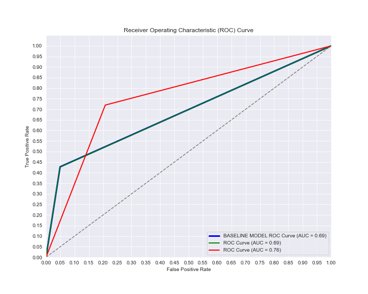
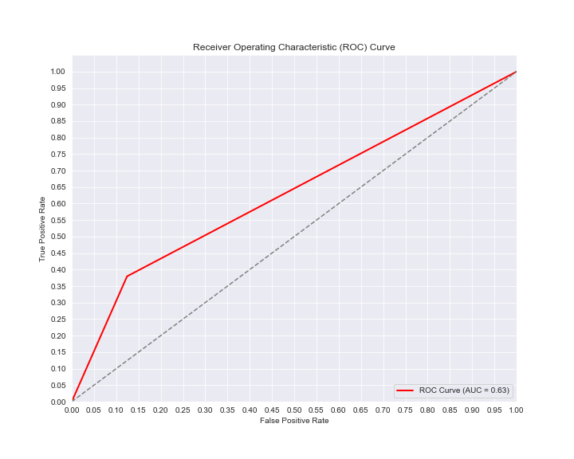
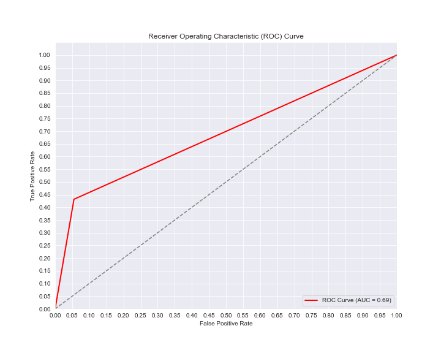

# Project_Phase_3

### Overview

The goal of this project is to predict whether people got H1N1 vaccine using information they shared about their backgrounds, opinions, and health behaviors?

In this challenge, we will take a look at vaccination, a key public health measure used to fight infectious diseases. Vaccines provide immunization for individuals, and enough immunization in a community can further reduce the spread of diseases through "herd immunity."

# 1.Business Understanding

Vaccine manufacturers might be interested in understanding the factors that influence vaccine uptake among the general population. This information can aid them in marketing strategies and production planning.

Recently a newly established Pharmaceutical Company called Jogoo Pharma delved into the vaccine making business. They are interested in understanding the factors that cause the vaccine uptake among the general population so that it can aid them in marketing strategies and control their production volume on the outcome of this specific project.

The datasource available to us is the National 2009 H1N1 Flu Survey (NHFS).

This project should help the company and its stakeholders in its endeavours and also comes amid the trail left by COVID-19 recently which shook the world.

This project should provide understanding to the potential upcoming of new respiratory diseases like COVID or H1N1.

# 2.Data Understanding

##### Data Sources and the dataset
The Dataset available to us is the H1N1 and Seasonal Flu Dataset collected by the United States 
The dataset avalable to us comes in three parts, that is:
* **training_set_features.csv**: This contains the multiclass predictors of the training data we will be working with here in this notebook.
* **training_set_labels.csv**: This contains two  targets we will be working with that is the seasonal vaccine and the h1n1 vaccine but we will be choosing the h1n1 vaccine label only.

* **test_set_features.csv** : This contains test data we will be feeding into our final model after we successfully come up with one .

# 3.Models
Considering the Project was on predicting a binary outcome, Classification Machine Learning Models were used.

Various Models were used such as:

- Logistic Regression 
- Desicion Trees 
- Random Forests 
- Ensemble Methods such as gradient Boost , XGBoost and Ada Boost.

The Models were evaluated throughly using Classification metrics such as recall,precision, f1_score and accuracy. Recall Scores were prioritised over other metrics because it was crucial for us to maximize the predictions of True Positives as opposed to others.
# Evaluation
The following is a Roc Curves fo the Models used:

The following is A Table to show The best Metrics of Each Models used:

|   models  |       |      Best Performance     |    |    |
|:-----------------:|:------:|:---------:|:--:|:--:|
|     |   **Precision**  |     **Recall**    |   **f1-score** |    **Accuracy**|
|    Logistic Regression   |  0.49   |   0.72   |   0.58  | 0.78 |
|     Desicion Tree   |   0.56     | 0.56    |  0.56 | 0.81|
| Random Forest  |    0.69    | 0.42    | 0.52   | 0.83 |
| AdaBoost  | 0.59   |   0.53    |  0.56  | 0.82 |
| Gradient Boost |  0.65   |  0.50   |   0.57 | 0.84 |
| XGBoost |    0.66 |  0.45  |    0.54   |   0.83   |
## Conclusions
The Final Model we used was Logistic Regression Model because it outperformed the other Model in that it provided us with better metrics than the all other classification models we used.`(Refer to the table above for the best metrics)`

The predictions on our test data indicates that 68 % of the observations recorded did not take the h1n1 vaccine .The Modelling steps above took priority in having good recall scores to maximaze the capturing of true positives.

- Since the dataset had an a Majority of 65+ years observations in the `age group` column, it is safe to say that we should target the specified age group for marketing

- The dataset also had abundancy in female observations in the `sex` column, implying that on Majority females are likely to go for vaccines more than males. So the comapany should focus more on them in their outreach.

***for More detailed discussion about the project,please refer to the notebook as it contains detailed visualizations and more understanding.***

